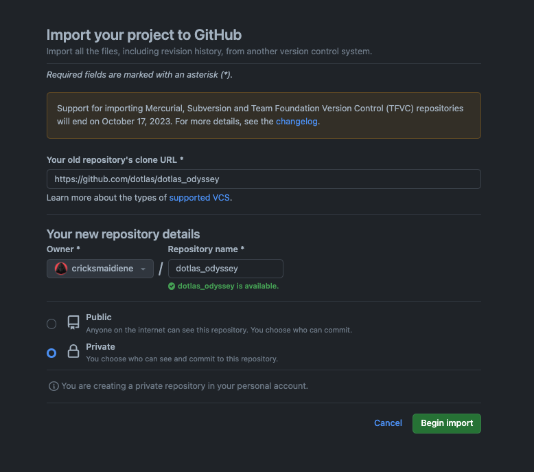

# Dotlas Odyssey ⛵️

A data engineering assignment

- [Dotlas Odyssey ⛵️](#dotlas-odyssey-️)
  - [Overview 🗼](#overview-)
    - [Stage 1: **Amalgamation** 🪢](#stage-1-amalgamation-)
    - [Stage 2: **Augmentation** 🧱](#stage-2-augmentation-)
    - [Stage 3: **Acclamation** ☑️](#stage-3-acclamation-️)
    - [Deliverables](#deliverables)
  - [Getting started 🏎](#getting-started-)
    - [Create a Private fork 🍴](#create-a-private-fork-)
    - [Install Python `v3.9` or higher 🐍](#install-python-v39-or-higher-)
    - [Install dependencies 📦](#install-dependencies-)
    - [Get crackin' ⌛️](#get-crackin-️)
  - [Submission 🏝](#submission-)
  - [Grading Criteria 📝](#grading-criteria-)
    - [Problem Solving 🕵🏼‍♀️](#problem-solving-️)
    - [Data 📇](#data-)
    - [Pipeline ⛳️](#pipeline-️)
    - [Code 🧼](#code-)
  - [Contact Us 💬](#contact-us-)

## Overview 🗼

In this assignment, you will embark on a data expedition involving the amalgamation of disparate data sources, web scraping for additional data fields, and the implementation of data quality tests to ensure production readiness.

### Stage 1: **Amalgamation** 🪢

In the first stage, you will be provided with multiple smaller datasets, each containing a subset of the overall data needed for the expedition. Your task will be to combine these smaller datasets into a single, cohesive dataset that will serve as the foundation for the next stage of the assignment.

- Load the provided datasets into a suitable data structure, such as a pandas DataFrame.
- Perform exploratory data analysis (EDA) to understand the structure, format, and quality of the data.
- Combine the smaller datasets into a single dataset, ensuring that the data is correctly aligned and that there are no duplicate or missing entries.
- Perform initial data cleaning and transformation tasks, such as dealing with missing values, normalizing data, and transforming data types.

### Stage 2: **Augmentation** 🧱

In the second stage, you will augment the dataset created in Stage 1 by extracting additional fields from the web. These additional fields will provide more context and depth to the dataset, making it more valuable for production use-cases.

- Identify suitable web sources from which to extract the additional fields.
- Use web scraping techniques, such as BeautifulSoup or Scrapy, to extract the additional fields from the identified web sources.
- Merge the extracted data with the dataset created in Stage 1, ensuring that the data is correctly aligned and that there are no duplicate or missing entries.

### Stage 3: **Acclamation** ☑️

In the final stage, you will implement a series of data quality tests to ensure that the final dataset is of high quality and ready for production use.

- Define a set of data quality tests that the final dataset must pass. These tests should cover aspects such as completeness, uniqueness, validity, accuracy, and consistency.
- Implement the defined data quality tests using appropriate testing frameworks, such as pytest.
- Run the implemented tests on the final dataset and document the results.

### Deliverables

Upon completion of the assignment, you should have a single, cohesive dataset that has been augmented with additional fields extracted from the web and that has passed all defined data quality tests.

## Getting started 🏎

### Create a Private fork 🍴

Let's create a private fork of this repository:

- [Go to the Import a repository page on GitHub](https://github.com/new/import)
- Fill in the information as shown below:

  <p align="center">
    
    <p align="center">How to create a private fork</p>
  </p>

Once the repository is created on GitHub, clone it onto your local system!

### Install Python `v3.9` or higher 🐍

- You can download it from the [Python website](https://www.python.org/downloads/release/python-3105/)
- Or, you can install [Anaconda](https://www.anaconda.com/) and run the following command in your terminal:

  ```bash
  conda create --name dotlas python=3.9 -y
  conda activate dotlas
  ```

### Install dependencies 📦

```bash
python -m pip install -r requirements
```

> You may install any additional dependencies!

### Get crackin' ⌛️

Your odyssey's details are displayed in [odyssey.ipynb](./odyssey.ipynb).

## Submission 🏝

Once you're ready for evaluation, [invite us](#contact) as [private collaborators to your private fork](https://docs.github.com/en/account-and-profile/setting-up-and-managing-your-personal-account-on-github/managing-access-to-your-personal-repositories/inviting-collaborators-to-a-personal-repository)!

## Grading Criteria 📝

### Problem Solving 🕵🏼‍♀️

- **Investigative**: Demonstrate curiosity by deeply exploring the data, uncovering hidden patterns, and asking insightful questions.
- **Detail-Oriented**: Be meticulous in cleaning & transforming the data as well as coding the solution.
- **Critical Thinking**: Question assumptions, consider biases, and weigh the implications of different problem-solving approaches.
- **Creativity**: Develop novel approaches for data transformation, feature engineering, and pipeline design.
- **Optimization**: Optimize code and the pipeline for performance, efficiency, and scalability. This includes speeding up the code, reducing memory usage, and adapting the pipeline for larger datasets.

### Data 📇

- **Quality**: Check for duplicates, errors, missing values, and type mismatches. Assess each field's quality to ensure the dataset accurately reflects the real world.
- **Completeness**: Make sure there are no missing values and that all rows and columns contain meaningful data.
- **Feature Engineering**: Creatively generate new, relevant features from the existing data. This may involve combining features, creating derived features, or extracting new information.
- **Preprocessing**: Properly normalize or standardize the features to prepare the dataset for machine learning models.

### Pipeline ⛳️

- **Edge-Case Handling**: Ensure your pipeline can handle a new but similar dataset with the same schema and doesn't fail on edge cases.
- **Modularity**: Use short code cells and wrap commonly used code into reusable functions.
- **No Artifacts**: The pipeline should run end-to-end, transforming the input data into the required output if the notebook is re-run. There shouldn't be any ad-hoc functions or code blocks.
- **Generic Solutions**: Solve problems and code solutions for general cases, not specific ones.
- **Use of Libraries**: Appropriate use of external libraries and Python packages. Do not reinvent the wheel unnecessarily, but also do not use a library for a simple task that can be accomplished easily with built-in Python functions.

### Code 🧼

- **Formatting**: Ensure the code is neatly formatted according to Python's style guides.
- **Pythonic Principles**: Use Python’s features and idioms correctly. For example, use list comprehensions and generators where appropriate.
- **Error Handling**: Handle errors and exceptions gracefully to prevent crashes or incorrect results.
- **Avoid Hardcoding**: Don't hardcode values or use inflexible code styles. This is related to error handling.
- **Documentation**: Document the code clearly and concisely using docstrings. Avoid in-line comments. Use Markdown cells in the notebook for context at key points. Don't create a Markdown cell for every code cell.
- **Vectorize**: Avoid tedious row-wise iterations of large tables and instead use vectorized functions.

## Contact Us 💬  

Feel free to reach out to us, should you have any questions.

| Name            | LinkedIn                               | GitHub                            |
| :-------------- | :------------------------------------- | :-------------------------------- |
| Eshwaran Venkat | <https://linkedin.com/in/eshwaranv98/>   | <https://github.com/cricksmaidiene> |
| Kelvin DeCosta  | <https://linkedin.com/in/kelvindecosta/> | <https://github.com/kelvindecosta>  |
